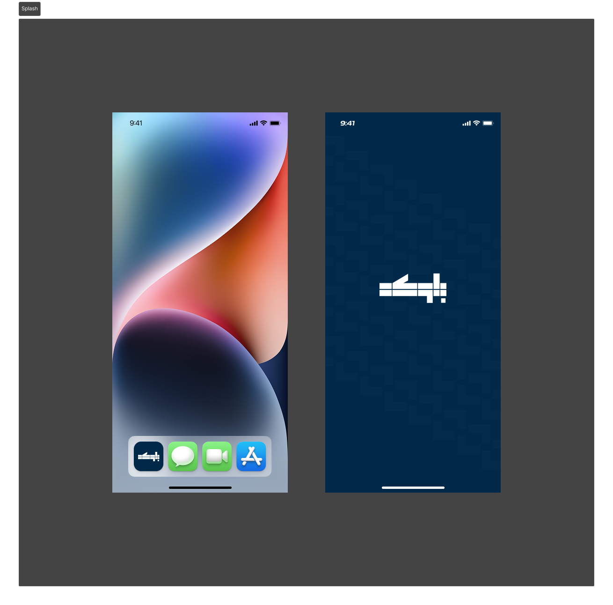
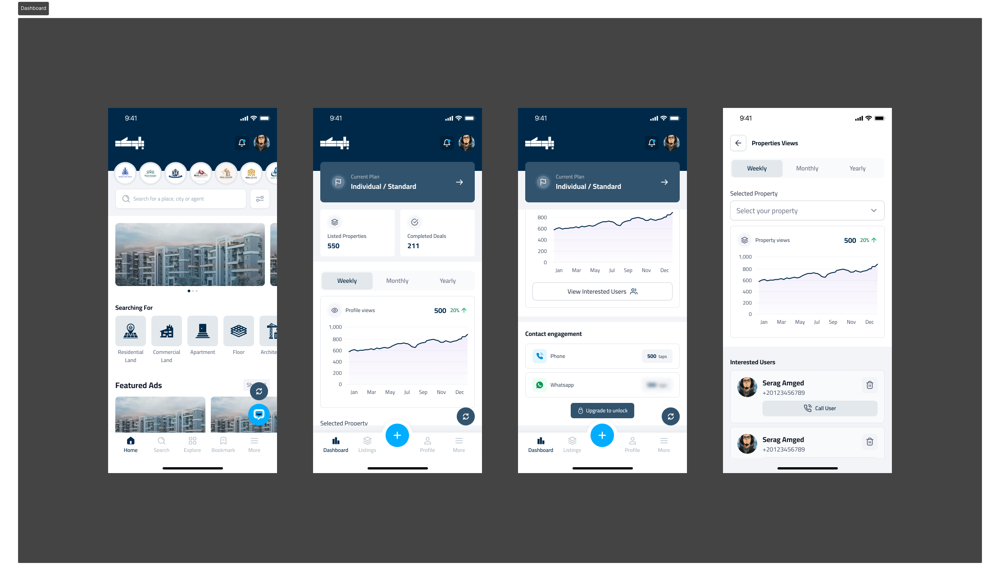
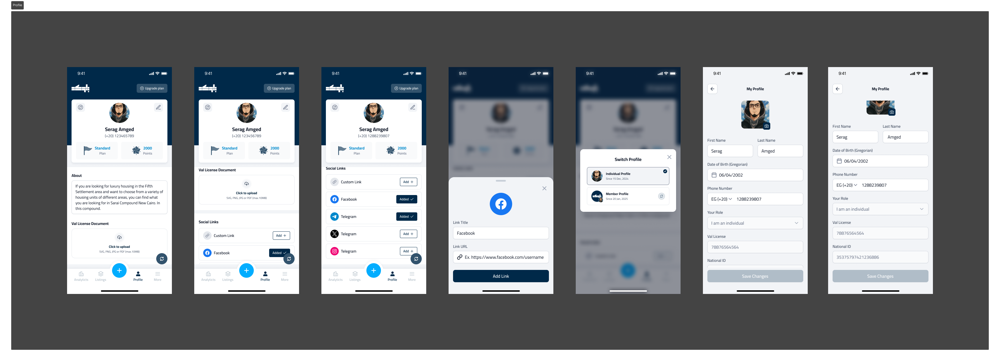
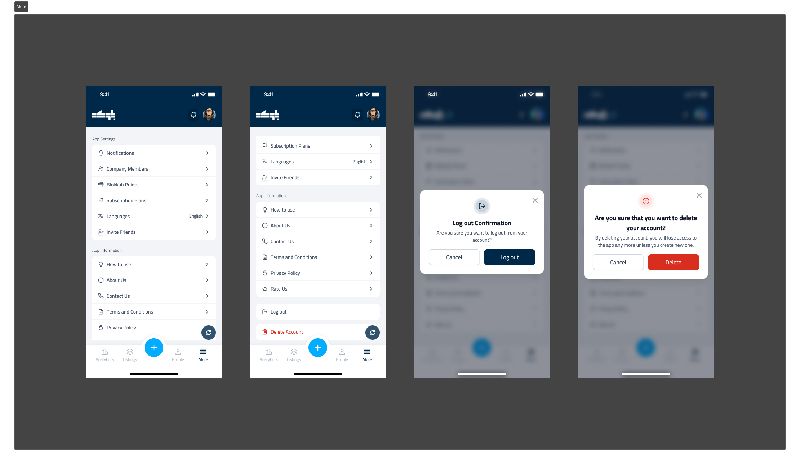
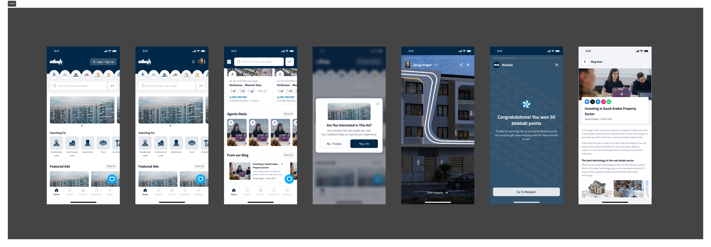
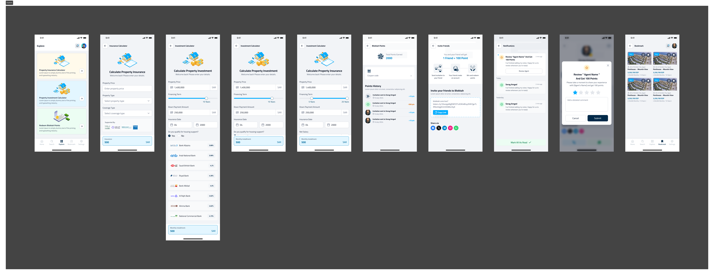
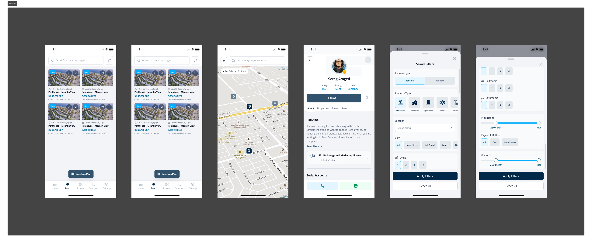
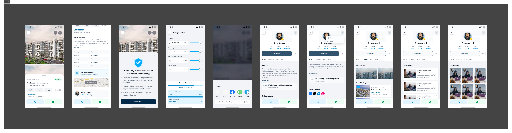
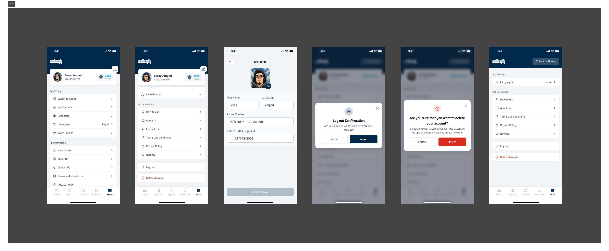

# Blokkah 🏢


A modern property marketplace mobile application built with Flutter, offering a seamless experience for property buyers, sellers, and agents. Features an AI-powered chatbot, real-time notifications, and multilingual support.

## ✨ Key Features

- 🏠 Property Listings with Advanced Filters
- 🏢 Agent Profiles
- 🔍 Search Functionality
- 🗂️ Saved Properties & Favorites
- 📊 User Profiles & Ratings
- 📈 Market Trends & Insights
- 🏦 Payment Integration (paymob)
- 🤖 AI-Powered Chatbot Assistant
- 🔐 Secure Authentication (Email, Google, Twitter)
- 🌙 Dynamic Theme (Light/Dark Mode)
- 🌐 Multilingual Support (English & Arabic)
- 📍 Interactive Maps & Location Services
- 🔔 Real-time Push Notifications
- 📱 Intuitive Onboarding Experience
- 💼 Property Management Dashboard
- 📊 Analytics & Performance Tracking

## 🎯 Technical Highlights

- **State Management**: Advanced BLoC pattern implementation with proper state handling
- **Custom Widgets**: Reusable widget library following Material Design 3 guidelines
- **API Integration**: RESTful API integration with error handling and retry mechanisms

## 🏗️ Architecture & Design Patterns

### BLoC-First Architecture
We chose a Feature-First architecture with BLoC pattern because:

#### 1. Project Structure
```
lib/
├── bloc_observer.dart      # Global BLoC state observer
├── firebase_options.dart   # Firebase configuration
├── main.dart              # Application entry point
├── generated/            # Generated localization files
├── l10n/                # Localization resources
├── layout/              # Core layout components
│   ├── app/            # Main app layout with bottom navigation
│   └── fab/            # Floating action button & dialogs
├── models/             # Data models and DTOs
├── modules/           # Feature modules
│   ├── authentication/  # Auth related features
│   ├── home/           # Home screen features
│   ├── property/       # Property listing features
│   ├── crm/           # CRM & Analytics features
│   └── more/          # Additional features
└── shared/           # Shared components
    ├── cubit/        # Global state management
    ├── router/       # Navigation & routing
    ├── theme/        # App theming & styling
    ├── utils/        # Common utilities
    └── widgets/      # Reusable widgets
```

#### 2. Architecture Benefits

- **Feature Separation**: Each feature (property, authentication, CRM) is self-contained
- **State Management**: BLoC pattern for predictable state handling
- **Modular Design**: Features can be developed and tested independently
- **Code Organization**: Clear separation between UI, business logic, and data
- **Scalability**: Easy to add new features without affecting existing one

## 📱 Screenshots

### 🧑‍💼 Agent Flow

* 
* 
* 
* 
* 
* 
* 
* 
* 
* 
* 


### 🙋‍♂️ User Flow

* 
* 
* 
* 
* 
* 
* 
* 


## 🛠️ Technologies Used

- **Framework**: Flutter 3.x
- **State Management**: Flutter Bloc
- **Backend Services**: Firebase (Auth, Analytics, Messaging)
- **Maps**: Google Maps Flutter
- **Networking**: Dio
- **Local Storage**: SharedPreferences
- **Localization**: Flutter Intl
- **Authentication**: Firebase Auth, Google Sign-In, Twitter Login
- **Notifications**: Firebase Cloud Messaging, Flutter Local Notifications
- **Analytics**: Firebase Analytics
- **Branch.io**: Deep Linking
- **Payment Integration**: Paymob


## 📥 Download
> **Note**: App download links may not be available as the client didn't deploy. Check back later.

[](https://apps.apple.com/app/blokkah)
[](https://play.google.com/store/apps/details?id=com.blokkahco.blokkah)


